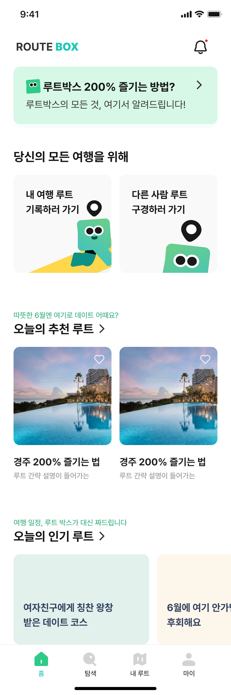

<!-- Improved compatibility of back to top link: See: https://github.com/othneildrew/Best-README-Template/pull/73 -->

<a name="readme-top"></a>


<!-- PROJECT LOGO -->
<br />
<div align="center">
  <a href="">
    
  </a>

  <h3 align="center">Route Box 루트박스</h3>

  <p align="center">
    여행 경로 추천 앱, 루트박스
  </p>
</div>

<!-- TABLE OF CONTENTS -->
<details>
  <summary>Table of Contents</summary>
  <ol>
    <li>
      <a href="#about-the-project">About The Project</a>
      <ul>
        <li><a href="#built-with">Built With</a></li>
      </ul>
    </li>
    <li>
      <a href="#getting-started">Getting Started</a>
      <ul>
        <li><a href="#installation">Installation</a></li>
      </ul>
    </li>
    <li><a href="#roadmap">Roadmap</a></li>
  </ol>
</details>

<!-- ABOUT THE PROJECT -->

## About The Project



### Built With

- [![React][React.js]][React-url]
- [![StyledComponent][StyledComponent]][StyledComponent-url]
- [![ReactQuery][ReactQuery]][ReactQuery-url]
- [![Storybook][Vitest]][Vitest-url]
- [![Nginx][Nginx]][Nginx-url]
- [![Docker][Docker]][Docker-url]
- [![AWS][AWS]][Aws-url]

<p align="right">(<a href="#readme-top">back to top</a>)</p>

<!-- GETTING STARTED -->

## Getting Started

### Installation

1. Clone the repo
   ```sh
   git clone https://github.com/Route-Box/route_box_web.git
   ```
2. Install packages
   ```sh
   bun install
   ```
3. Enter your environment variable in `.env`
   ```js
   VITE_API_URL = 'YOUR API_URL';
   VITE_API_KEY = 'YOUR API KEY';
   VITE_APP_BUILD_ENV = 'YOUR APP BUILD ENV';
   ```

<p align="right">(<a href="#readme-top">back to top</a>)</p>


## Milestone
- 랜딩페이지 및 SEO 적용
- 아이콘 분리 및 웹폰트 변경 (fantastic icon 적용)
- Remix 로 마이그레이션 (앱브릿지 확인 필요)
- 테스트 코드 추가
- mocking 추가
- 마이페이지 수정 기능

<!-- MARKDOWN LINKS & IMAGES -->

[product-screenshot]: public/screenshot.jpg
[React.js]: https://img.shields.io/badge/React-20232A?style=for-the-badge&logo=react&logoColor=61DAFB
[React-url]: https://reactjs.org/
[Vite]: https://img.shields.io/badge/Vite-20232A?style=for-the-badge&logo=vite&logoColor=646CFF
[Vite-url]: https://vitejs.dev/
[Vitest]: https://img.shields.io/badge/Vitest-20232A?style=for-the-badge&logo=vitest&logoColor=6E9F18
[Vitest-url]: https://vitest.dev/
[ReactQuery]: https://img.shields.io/badge/ReactQuery-20232A?style=for-the-badge&logo=reactquery&logoColor=FF4154
[ReactQuery-url]: https://tanstack.com/
[StyledComponent]: https://img.shields.io/badge/StyledComponents-20232A?style=for-the-badge&logo=styledcomponents&logoColor=DB7093
[StyledComponent-url]: https://styled-components.com/
[Nginx]: https://img.shields.io/badge/NGINX-20232A?style=for-the-badge&logo=nginx&logoColor=009639
[Nginx-url]: https://www.nginx.com/
[Docker]: https://img.shields.io/badge/Docker-20232A?style=for-the-badge&logo=docker&logoColor=2496ED
[Docker-url]: https://www.docker.com/
[AWS]: https://img.shields.io/badge/aws-20232A?style=for-the-badge&logo=amazonwebservices&logoColor=ffffff
[AWS-url]: https://aws.amazon.com/ko/
